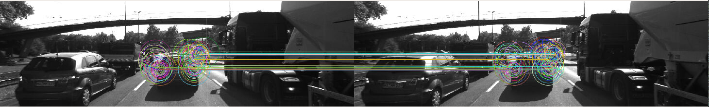
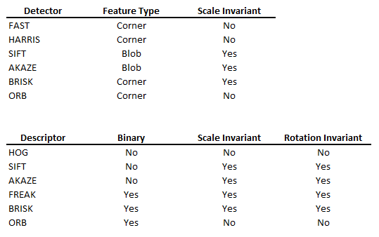
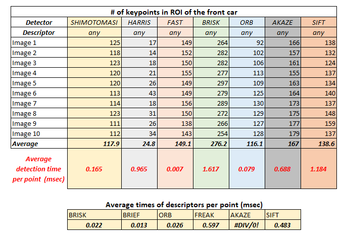

# SFND 2D Feature Tracking - COMPLETED PROJECT
started code at: https://github.com/udacity/SFND_2D_Feature_Tracking


The steps:

* First, loading images, setting up data structures and putting everything into a ring buffer to optimize memory load. 
* Then, integrate several keypoint detectors such as HARRIS, FAST, BRISK and SIFT and compare them with regard to number of keypoints and speed. 
* In the next part, focus on descriptor extraction and matching using brute force and also the FLANN approach. 
* In the last part, test the various algorithms in different combinations and compare them with regard to some performance measures. 

Roughly 42 combinations tested with 7 detectors options (SHITOMASI, HARRIS, FAST, BRISK, ORB, AKAZE, SIFT) and 6 descriptors (BRISK, BRIEF, ORB, FREAK, AKAZE, SIFT)

Exameples of the results:

Detector: BRISK - Descriptor: BRISK


Detector: ORB- Descriptor: BRIEF


Detector: SHITOMASI - Descriptor: BRISK


In this project the goal was to build the feature tracking and test various detector / descriptor combinations to see which ones perform best. The table below could be a good guide when selecting the detector and descriptor for an application.


Table below shows the summary of the performance. It shows the stability of the detectors over 10 images, their compute times per point, and also the descriptors compute time per point. The number of matched points for each descriptor detector combinatioin has also been compared and analyzed but is not shown in the table.


## Dependencies for Running Locally
1. cmake >= 2.8
 * All OSes: [click here for installation instructions](https://cmake.org/install/)

2. make >= 4.1 (Linux, Mac), 3.81 (Windows)
 * Windows: [Click here for installation instructions](http://gnuwin32.sourceforge.net/packages/make.htm)

3. OpenCV >= 4.1
 * All OSes: refer to the [official instructions](https://docs.opencv.org/master/df/d65/tutorial_table_of_content_introduction.html)
 * This must be compiled from source using the `-D OPENCV_ENABLE_NONFREE=ON` cmake flag for testing the SIFT and SURF detectors. If using [homebrew](https://brew.sh/): `$> brew install --build-from-source opencv` will install required dependencies and compile opencv with the `opencv_contrib` module by default (no need to set `-DOPENCV_ENABLE_NONFREE=ON` manually). 
 * The OpenCV 4.1.0 source code can be found [here](https://github.com/opencv/opencv/tree/4.1.0)

4. gcc/g++ >= 5.4
  * Windows: recommend using either [MinGW-w64](http://mingw-w64.org/doku.php/start) or [Microsoft's VCPKG, a C++ package manager](https://docs.microsoft.com/en-us/cpp/build/install-vcpkg?view=msvc-160&tabs=windows). VCPKG maintains its own binary distributions of OpenCV and many other packages. To see what packages are available, type `vcpkg search` at the command prompt. For example, once you've _VCPKG_ installed, you can install _OpenCV 4.1_ with the command:
```bash
c:\vcpkg> vcpkg install opencv4[nonfree,contrib]:x64-windows
```
Then, add *C:\vcpkg\installed\x64-windows\bin* and *C:\vcpkg\installed\x64-windows\debug\bin* to your user's _PATH_ variable. Also, set the _CMake Toolchain File_ to *c:\vcpkg\scripts\buildsystems\vcpkg.cmake*.


## Basic Build Instructions

1. Clone this repo.
2. Make a build directory in the top level directory: `mkdir build && cd build`
3. Compile: Using Visual Studio
4. Run it: `./2D_feature_tracking`.
